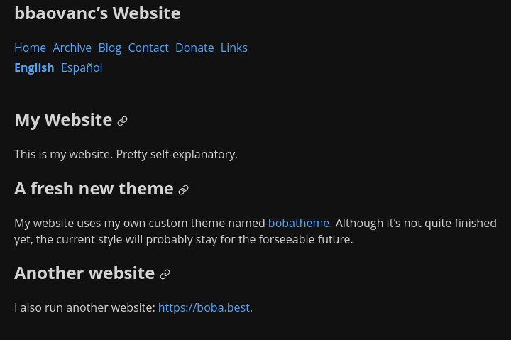

---

title: The redesign of my website
date: 2021-10-16
toc: true
draft: true

tags:
  - announcement
  - blog
  - hugo

resources:
  - name: feature
    src: bobatheme.webp
    title: Homepage on bbaovanc.com, using bobatheme.

---

For the past three weeks I've been designing and perfecting a new theme for my
website: bobatheme from scratch. I tried to keep it simple without looking ugly.

<!--more-->

## A total redesign

I've switched to a new theme. Visually, it's similar to
[hugo-bearblog](https://github.com/janraasch/hugo-bearblog) which was the theme
I had previously. Bearblog does a great job for being simple and very light, but
it's not quite for me. bobatheme has a lot of fancy features thanks to Hugo. For
example: list pages (such as [/blog/](/blog/)) have previews for each article,
including featured images or videos for some articles, you can link to specific
headers in an article, and articles have metadata such as word count, reading
time, and the git commit that last modified them. However, the biggest feature
bobatheme has over the previous themes I've used is **icons**.

### Icons

I'm using an icon pack called [Feather](https://feathericons.com/). Using Hugo,
I have a template that just takes the contents of the SVG file and inserts it
directly into the HTML source code. While that increases the size of the HTML
file, it minimizes the amount of requests that your browser has to make, and it
doesn't really increase the size by very much in the end after compression.

### No JavaScript (yet)

There isn't any JavaScript yet, but I think I'll probably use a little to add
some features such as copying code blocks to the clipboard. (I couldn't think of
any other ideas to put here.)

## My website is on GitHub

My website was previously on git.bbaovanc.com, but I [moved it to
GitHub](https://github.com/BBaoVanC/bbaovanc.com) to take
advantage of a cool feature:

### Netlify

Every pull request has its own preview built for it using Netlify, which is
linked in a comment.

## Translations

I'm working on translating all pages on my site to Spanish. I'm open to
translations for other languages, but I don't know any others so I won't be
able to help.

### Tracking Status

I'm currently tracking translation status using [projects on
GitHub](https://github.com/BBaoVanC/bbaovanc.com/projects). Each language has
one "progress" project which shows each page's translation status in the
language, and a second "pull requests" project which organizes individual pull
requests.

### Contribute translations

If you speak any other languages (especially Spanish), then I'd really
appreciate it if you could review any [open translation-related pull
requests](https://github.com/BBaoVanC/bbaovanc.com/pulls?q=is%3Apr+is%3Aopen+label%3Atranslation-needs-review).
If you have some free time, I'd also appreciate it even more if you could create
some new translations into other languages, or write translations for pages that
aren't already translated.

Just remember to read the [contribution
guidelines](https://github.com/BBaoVanC/bbaovanc.com/blob/master/CONTRIBUTING.md)
before contributing as I have some important information such as how to build
the site yourself instead of having to wait for Netlify.
